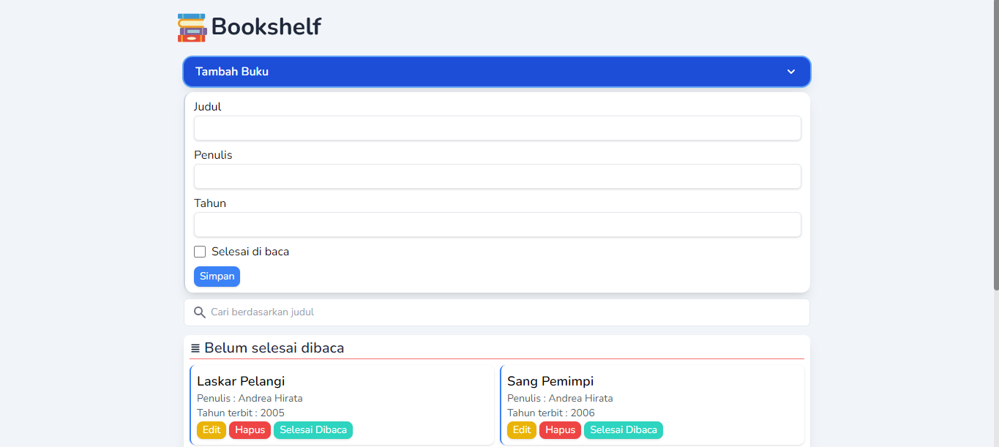
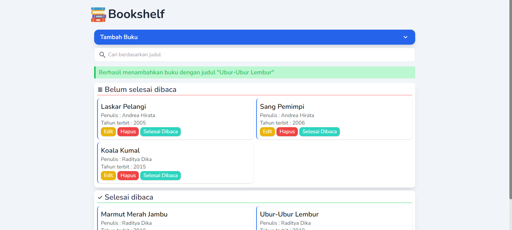
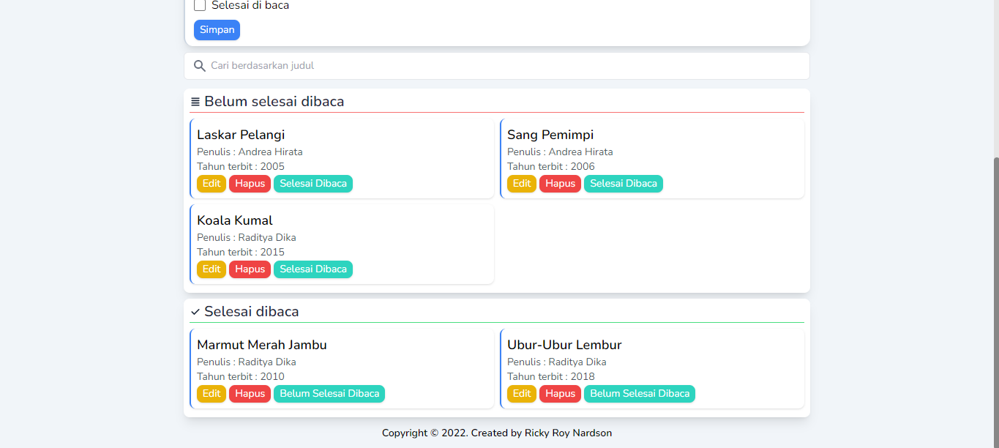
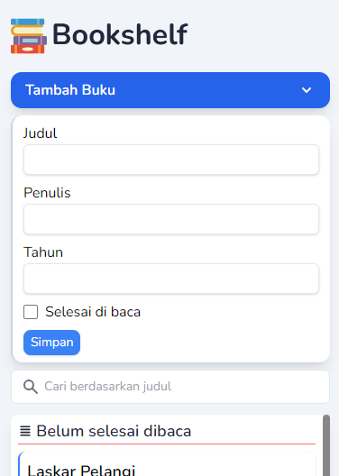
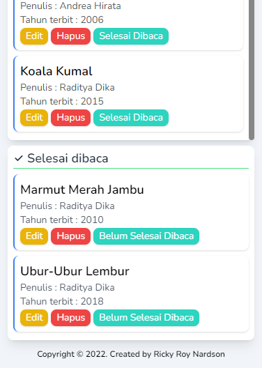

# Bookshelf

Sebuah website sederhana untuk mengelola daftar buku yang terbagi menjadi 2 rak (selesai dibaca dan belum selesai dibaca) yang dibuat dengan harapan agar tuntas di submission "Belajar Membuat Front-End Web untuk Pemula" dari Dicoding.

# Preview

> Desktop

> Mobile

